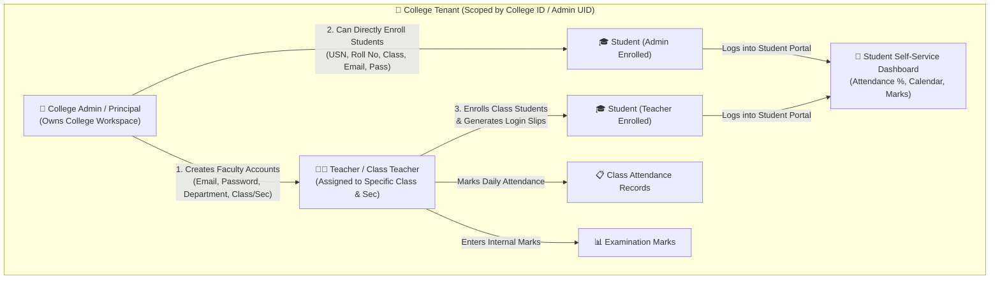
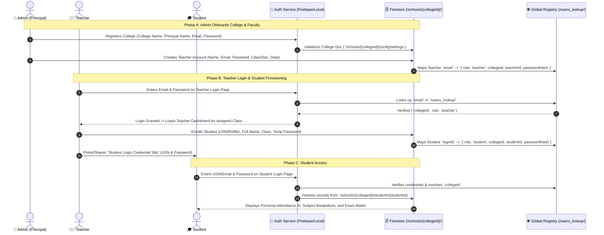

# 🏛️ 3-Tier Multi-Tenant College Management System: Complete Architectural & Implementation Plan

---

## 📌 Executive Summary

This architecture establishes a **Hierarchical Multi-Tenant College System** connecting three distinct user roles:
1. **Admin (Principal / College Authority)** — Top-level tenant owner. Provisions and supervises the college workspace, faculty (Teachers), academic settings, and institution-wide student registries.
2. **Teacher (Faculty / Class Teacher)** — Intermediate authority. Authenticates against Admin-created credentials, manages assigned classes/sections, marks daily subject/class attendance, and directly enrolls new students into their class, generating downloadable/shareable credential slips.
3. **Student** — Portal end-user. Authenticates against Admin- or Teacher-provisioned credentials, views personal attendance records, monthly calendars, subject breakdowns, internal exam marks, and college notices.

All Teacher and Student entities are **cryptographically and relationally linked to the Admin's unique College ID (`collegeId`)**, ensuring absolute data isolation between different colleges while allowing seamless login verification.

---

## 📐 System Architecture & Diagrams

### 1. Hierarchical Authority Diagram



---

### 2. End-to-End Account Provisioning & Login Verification Flow



---

## 🗄️ Database & Tenant Scoping Model

### Firestore Document Structure

To maintain high performance, strict multi-tenant isolation, and fast role-based queries, the database uses a combination of **tenant-scoped subcollections** and a **lightweight global lookup index**:

```
firestore-root
│
├── schools/                                      <-- Multi-Tenant Root
│   └── {collegeId}/                              <-- Admin's Firebase UID / College Key
│       ├── config/
│       │   └── settings                          <-- College Name, Principal Name, Admin Email, Working Days
│       │
│       ├── teachers/                             <-- Faculty created by this Admin
│       │   └── {teacherId}/
│       │       ├── id: "TCH_101"
│       │       ├── name: "Prof. Rajesh Kumar"
│       │       ├── email: "rajesh@college.edu"
│       │       ├── password: "hashed_or_vaulted_pwd"
│       │       ├── assignedClass: "CSE-A"
│       │       ├── department: "Computer Science"
│       │       ├── collegeId: "{collegeId}"
│       │       └── createdBy: "{adminUid}"
│       │
│       ├── students/                             <-- Students in this College
│       │   └── {studentId}/
│       │       ├── id: "STU_2026_001"
│       │       ├── usn: "1RV21CS001"
│       │       ├── name: "Pooja Sharma"
│       │       ├── email: "pooja@college.edu"
│       │       ├── password: "student_default_pass"
│       │       ├── class: "CSE-A"
│       │       ├── rollNumber: "01"
│       │       ├── collegeId: "{collegeId}"
│       │       ├── enrolledBy: "TEACHER" | "ADMIN"
│       │       ├── enrolledById: "{teacherId}"
│       │       └── createdAt: timestamp
│       │
│       ├── attendance/                           <-- Daily Attendance Logs
│       │   └── {date_class_subject}/
│       │       ├── date: "2026-09-29"
│       │       ├── class: "CSE-A"
│       │       ├── subject: "Operating Systems"
│       │       ├── markedByTeacherId: "{teacherId}"
│       │       └── records: { "STU_2026_001": "present", ... }
│       │
│       └── exams/                                <-- Exam Marks
│           └── {examId}/
│
└── users_lookup/                                 <-- Fast Credential Routing Index
    ├── {sanitized_email_or_usn}/
    │   ├── identifier: "rajesh@college.edu"
    │   ├── role: "teacher" | "student" | "admin"
    │   ├── collegeId: "{collegeId}"
    │   ├── entityId: "{teacherId_or_studentId}"
    │   └── password: "{password}"
```

> [!IMPORTANT]
> **Why `users_lookup` collection?**
> When a Teacher or Student opens the login page, they do not want to enter a cumbersome `College ID` or code manually. By maintaining a lightweight `users_lookup/{identifier}` mapping, the system instantly identifies which college tenant the user belongs to and validates their credentials securely.

---

## 🔑 Role Capabilities & Linking Rules

| Feature / Permission | 👑 Admin (Principal) | 👨‍🏫 Teacher | 🎓 Student |
|---|:---:|:---:|:---:|
| **College Workspace Creation** | ✅ Full Ownership | ❌ | ❌ |
| **Institutional Settings (Name, Principal)** | ✅ Set at Registration (Locked) | ❌ Read Only | ❌ Read Only |
| **Create / Manage Teachers** | ✅ All Departments | ❌ | ❌ |
| **Create / Enroll Students** | ✅ Across Entire College | ✅ For Assigned Class/Sec | ❌ |
| **Share Credential Slips** | ✅ Can Print/Export | ✅ Can Print/Export for Class | ❌ |
| **Mark Class Attendance** | ✅ Global Override | ✅ Daily Subject/Class | ❌ Read Only |
| **Enter Exam Marks** | ✅ Global Access | ✅ Assigned Subjects/Class | ❌ Read Only |
| **Access Student Portal** | ❌ (Has Admin Dash) | ❌ (Has Teacher Dash) | ✅ Personal Stats Only |
| **Data Scope Visibility** | Entire College | Assigned Class & Section | Own Record Only |

---

## 🎫 Teacher-to-Student Credential Handover System

When a Teacher enrolls a student or a batch of students, the system provides an immediate **"Student Credential Slip"** generator:

### 1. Single Student Quick-Enroll Modal (In Teacher Portal)
- **Form Fields**:
  - Full Name (e.g. *Aryan Sharma*)
  - USN / Roll Number (e.g. *2026-CS-42*)
  - Class & Section (Auto-filled with the Teacher's assigned class)
  - Student Email (Optional or auto-generated: `usn@college.edu`)
  - Initial Password (Auto-generated random 6-character PIN or customizable)
- **Immediate Action**:
  - `Save & Generate Slip` button.
  - Generates a printable **Student Identity & Login Card**:
    ```
    ┌────────────────────────────────────────────────────────┐
    │  🏫 ADAE Public College                                │
    │  STUDENT LOGIN CREDENTIALS                             │
    ├────────────────────────────────────────────────────────┤
    │  Student Name : Aryan Sharma                           │
    │  Class/Section: CSE-A                                  │
    │  User ID / USN: 2026-CS-42                             │
    │  Default Pass : College@2026                           │
    │  Portal URL   : https://attendify.netlify.app          │
    ├────────────────────────────────────────────────────────┤
    │  Issued By    : Prof. Rajesh Kumar (Class Teacher)    │
    │  * Change your password upon your first login.        │
    └────────────────────────────────────────────────────────┘
    ```

### 2. Bulk CSV / Excel Import by Teacher
- Teacher uploads a spreadsheet with: `RollNo, Name, ParentPhone, Email`.
- The system automatically batches the creation into `/schools/{collegeId}/students/` and `/users_lookup/`.
- Downloadable PDF / Print view of all student credential slips in a grid layout (ready to cut and distribute to the class).

---

## 🔄 Detailed Implementation Roadmap

### Phase 1: Dynamic Tenant Scoping & Context Unification
- [ ] **Current State**: Codebase currently uses hardcoded `/schools/dps_main/`.
- [ ] **Modification**: 
  - Update `AuthContext.jsx` to dynamically supply `activeCollegeId` derived from logged-in Admin, Teacher, or Student session.
  - Modify `firestoreService.js` to accept `collegeId` parameter across all CRUD functions (`getTeachers(collegeId)`, `getStudents(collegeId)`, etc.), defaulting to `dps_main` during migration so existing data is never broken.

### Phase 2: User Lookup & Unified Verification Service
- [ ] Create `authRoutingService.js`:
  - `registerTeacherWithTenant(adminCollegeId, teacherData)`: Writes to `/schools/{collegeId}/teachers/{teacherId}` and creates index entry in `/users_lookup/{teacherEmail}`.
  - `registerStudentWithTenant(collegeId, studentData, enrolledBy)`: Writes to `/schools/{collegeId}/students/{studentId}` and creates index entry in `/users_lookup/{usn_or_email}`.
  - `verifyCredential(loginIdentifier, password, expectedRole)`: Performs direct lookup against `/users_lookup/` and returns `{ success, user, collegeId }`.

### Phase 3: Teacher Portal Enhancement (Student Enrollment & Credential Slips)
- [ ] Add **"Enroll Student"** button inside the Teacher's class view / student roster.
- [ ] Create `AddStudentModal.jsx` for Teachers with class pre-selected and locked to their assigned section.
- [ ] Create `CredentialSlipModal.jsx` featuring:
  - Clean card design with College logo/name.
  - "Print Slip" (`window.print()`) with print-optimized CSS.
  - "Copy Details" button to easily send to parent/student via WhatsApp or SMS.

### Phase 4: Student Portal Auth Verification
- [ ] Update `StudentLoginPage.jsx` to verify student logins via the lookup service.
- [ ] Upon successful authentication, store `{ role: 'student', studentId, collegeId }` in session.
- [ ] Ensure student queries only fetch documents matching their specific `studentId` from their respective `collegeId`.

---

## 🛡️ Security & Boundary Isolation Rules

1. **Tenant Segregation**:
   - Every read and write query in `AppContext.jsx` and component-level hooks is scoped to `activeCollegeId`.
   - Firestore security rules enforce:
     ```javascript
     match /schools/{collegeId}/{document=**} {
       allow read, write: if request.auth != null && 
         (request.auth.uid == collegeId || 
          get(/databases/$(database)/documents/users_lookup/$(request.auth.token.email)).data.collegeId == collegeId);
     }
     ```
2. **Immutable College Info**:
   - Institutional details (College Name, Principal Name, Admin Email) can only be written once during initial Admin creation and are permanently locked against modifications.
3. **Teacher Scoping**:
   - A Teacher assigned to `Class 10-A` cannot mark attendance or modify marks for `Class 12-B`.

---

## 🧪 Verification Plan

### 1. Multi-Tenant Segregation Test
- Create Admin Account A (`college_a@test.com`, "College Alpha").
- Create Admin Account B (`college_b@test.com`, "College Beta").
- Create Teacher in College A; verify Teacher is completely invisible in College B's admin panel.

### 2. Teacher-to-Student Enrollment Test
- Login as Teacher from College A.
- Enroll student "Rohan Gupta" (USN: `ALPHA_001`).
- Verify Credential Slip generates accurately with College Alpha's name and login details.
- Verify Admin of College A sees Rohan Gupta in the master college roster.
- Verify College B cannot see or access Rohan Gupta's record.

### 3. Student Login & Attendance Verification
- Open Student Login page.
- Enter USN `ALPHA_001` and the generated password.
- Verify login succeeds without asking the student for a College ID.
- Mark attendance for Rohan Gupta via Teacher portal; verify student portal updates in real-time.
